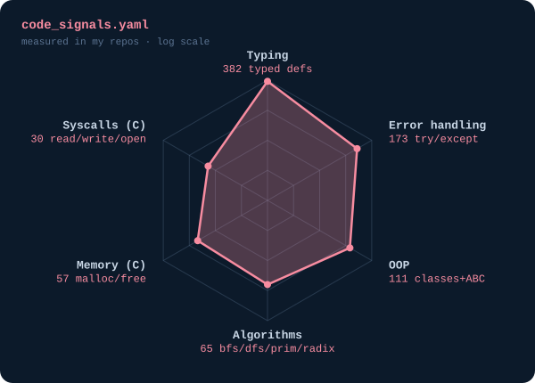
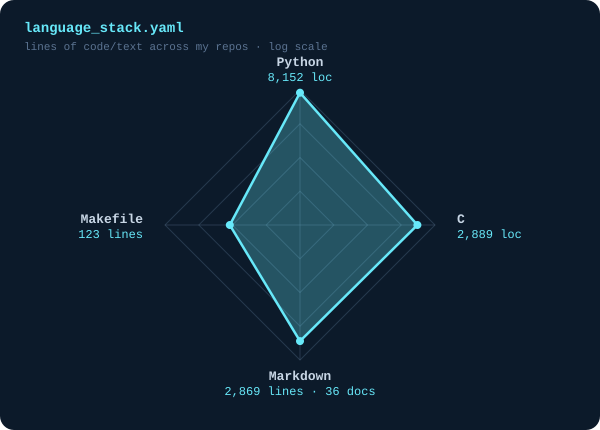

---

## `$ whoami`

  

--- 

## `$ cat tech-stack.yaml`

| `TU_USUARIO:~$ cat tech-stack.yaml` | |
| :--- | :--- |
| `├─ ✦ languages:`  `C · Python` | `├─ ▥ databases:`  `MySQL · PostgreSQL · MongoDB` |
| `├─ ▤ containers_ci_cd:`  `Docker · Kubernetes · GitHub Actions · GitLab` | `╰─ ✎ workflow:`  `Linux · Git · GitHub · Neovim · VS Code` |
| `status: ready  ·  environment: production` | |

---

## `$ ls ~/42/finished-projects`

  
|  Project | Overview | Built with |
|  :------ | :------- | :--------- |
| [Libft](https://github.com/Itzskade/Libft) | Custom C library: 45 functions, from `ft_atoi` to `ft_split`, plus linked lists (`t_list`) | C · Makefile · `libft.a` | 
| [Printf](https://github.com/Itzskade/Printf) | Recreate `printf()` with variadic arguments, built on top of Libft | C · `stdarg` · Libft | 
| [Get_next_line](https://github.com/Itzskade/Get_next_line) | Read one line at a time from a file descriptor, with a bonus for multiple fds | C · `read` · `malloc` · `BUFFER_SIZE` | 
| [Push Swap](https://github.com/Itzskade/Push_Swap) | Sort integers with two stacks: optimized for ≤ 5 elements, LSD radix sort (base 2) for larger inputs | C · Libft · 42 Norm | 
| [Python_Piscine](https://github.com/Itzskade/Python_Piscine) | 11 modules: OOP, exceptions, collections, imports, abstract classes, polymorphism, Pydantic and functional programming | Python · typing · abc · pydantic | 
| [A-Maze-ing](https://github.com/Itzskade/A-Maze-ing) | Team project: maze generation (DFS, randomized Prim), BFS solver, themes and config parser | Python · pydantic · mypy · flake8 | 
| [Call_me_maybe](https://github.com/Itzskade/Call_me_maybe) | Local LLM-based function-calling system using constrained decoding to generate structured, validated function calls from natural language prompts | Python · LLM · constrained decoding · pydantic |
| [Fly-in](https://github.com/Itzskade/Fly-in) | Drone routing simulation: finds efficient routes across a map handling obstacles, hub and connection capacities, movement restrictions and multiple drones moving turn by turn | Python · pathfinding · simulation | 
| [Codexion](https://github.com/Itzskade/Codexion) | Multithreaded simulation inspired by the Dining Philosophers problem, with FIFO and EDF scheduling: concurrent programmers competing for shared resources | C · `pthread` · mutexes · condition variables | 

---

## `$ kubectl get signals --all-namespaces`

 

 

---

## `$ connect --socials`

